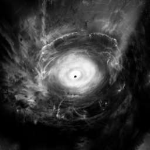

# Image Filter

Download an image from a public URL, filter the image, and return the filtered image to the client.

**URL** : `/api/v0/image/filter`

**Query Parameters**:

- `image_url`: Public URL of the image to filter.

**Method** : `GET`

**Auth required** : NO

## Success Response

**Condition** : If URL is valid and image type is supported (`PNG`, `JPG`, `JPEG`).

**Code** : `200`

**Content example**



### OR

**Condition** : Request was properly sent but application could not apply filter to image.

**Code** : `204`

**Content example**

```json
{ "message": "Error while filtering image" }
```

### OR

**Condition** : Filter was applied properly to image but image could not be returned to client.

**Code** : `204`

**Content example**

```json
{}
```

## Error Responses

**Condition** : If query parameter is missing.

**Code** : `400`

**Content** :

```json
{ "message": "Image URL required or malformed" }
```

### Or

**Condition** : If image url cannot be parsed using [url-parse](https://www.npmjs.com/package/url-parse).

**Code** : `400`

**Content** :

```json
{ "message": "Image URL malformed" }
```

### Or

**Condition** : If image type is not supported.

**Code** : `422`

**Content** :

```json
{ "message": "Image type not supported" }
```
